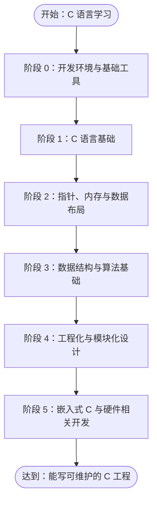

# C-Journey

A learning journal + community hub for C beginners and learners.

> 目标：不只是“会写 C 语法”，而是逐步具备使用 C 语言完成真实工程、库设计、系统编程、嵌入式开发的能力。

## 路线概览



## 内容亮点

- **阶段 0 ~ 1**：环境搭建、编译调试、语法基础、小型练习项目
- **阶段 2 ~ 3**：指针、内存管理、数据结构与算法实现（Vector、HashMap、环形缓冲区等）
- **阶段 4**：工程化（Makefile/CMake、静态/动态库、测试、Valgrind、文档）
- **阶段 5**：系统编程（进程、线程、网络、IO 多路复用、Mini Shell、HTTP Server）
- **阶段 6**：嵌入式 C（寄存器、中断、FreeRTOS、UART Shell、驱动分层）
- **阶段 7**：综合项目与开源协作（CI、PR、Code Review）

## 适合人群

- 已学过 C 语法，希望系统提升工程能力的开发者
- 在校学生或转嵌入式/系统方向的学习者
- 希望有一份“可落地”的 C 语言进阶路线图的团队或个人

## 如何使用

1. 按阶段顺序学习，每个阶段先阅读 `docs/` 中的知识点文档
2. 完成 `examples/` 中对应的实践项目
3. 在 `exercises/` 中做附加练习
4. 最终挑战综合项目，并尝试提交 PR 参与开源

## 仓库结构

```text
c-roadmap/
├── README.md
├── docs/               # 各阶段详细知识点
├── examples/           # 配套示例项目（计算器、Vector、日志库等）
├── exercises/          # 按难度分类的练习题
└── assets/             # 图片等资源
```

## 贡献

欢迎通过 Issue 和 PR 完善路线图、示例代码或文档。建议先阅读 [ROADMAP.md](./ROADMAP.md) 了解完整设计思路。

---

**开始你的 C 语言工程化之旅 →**

